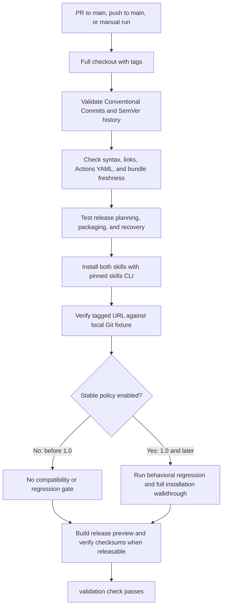
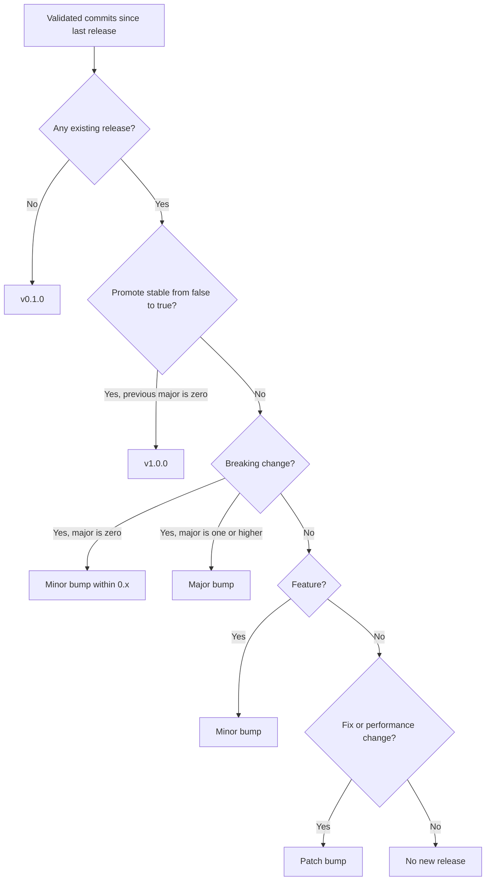
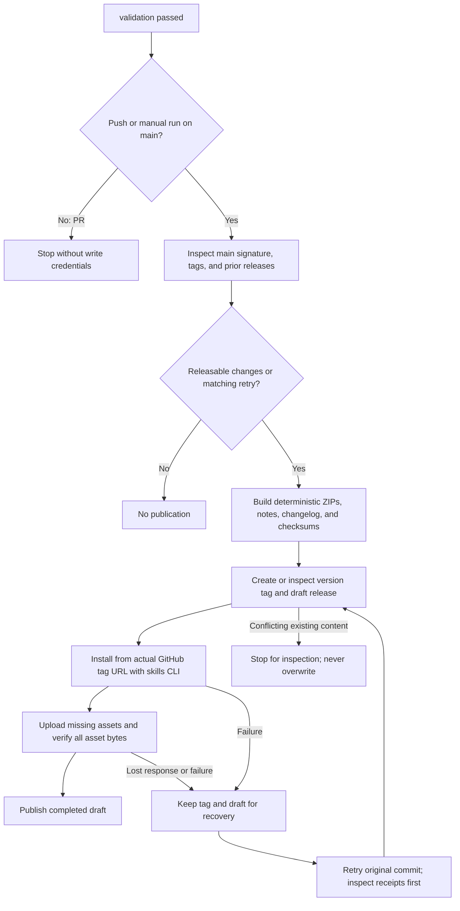

# GitHub Actions workflows

[Validate and release](../.github/workflows/validate-release.yml) uses the same Python entry points as local verification. These Mermaid diagrams render directly on GitHub. Actions provide checkout, pinned tool setup, event selection, credentials and concurrency; project logic lives in locally runnable scripts.

## Validation



Local equivalent, after committing changes and fetching main/tags:

```sh
python3 scripts/check.py --base upstream/main
```

Omit `--base` to lint all non-merge commits, as the main workflow does. Install Python 3.11+, Node.js 24, uv 0.12.23, Go 1.26+, Git, and the GitHub CLI. The scripts pin skills CLI 1.7.1 and actionlint 1.7.12. Actionlint's optional shellcheck/pyflakes integrations are explicitly disabled in both local and CI runs so installed host utilities cannot change the checks. Python source syntax is checked separately. npm, uv and Go need network access or populated caches.

Before 1.0 the release-tool tests establish correctness of the release machinery; they are not a backwards-compatibility or product-regression requirement. At/after 1.0 the existing behavioral suite and full installation walkthrough become mandatory. Contributors must also assess public-contract compatibility; a machine cannot infer whether a commit's declared type is truthful.

## Version selection



Local equivalent: `python3 scripts/release.py plan`. A reviewed `release.json` change opts into 1.0. No breaking marker can promote 0.x by itself.

## Publication and recovery



Local preview: `python3 scripts/publish.py --output /tmp/sparkle-preview` (fresh directory). Publication uses that same command with `--execute` and GitHub authentication. The real tag URL cannot be verified before the tag exists; the local fixture exercises tag selection beforehand, and the publication job checks the live provider before announcing the release. See [recovery instructions](RELEASING.md).

The workflow serializes main runs and never cancels a running publication. GitHub may replace queued pending runs; the next run considers every unreleased commit. If main advances during a job, publication stops rather than tagging an outdated checkout. Rerun on current main, or use the documented original-commit resume procedure when a tag/draft already exists. No `pull_request_target` event or PR write token is used.

## Repository configuration

Keep the signed merge-commit rules documented in [Contributing](../CONTRIBUTING.md). Once this workflow has run successfully, require the **validation** status check on main. Do not require **publication** before merging: it runs only after a merge. GitHub Actions must be enabled; only the publication job requests `contents: write`. No personal token, bot signing key, or protected-branch bypass is needed. Tag rules must allow the Actions token to create new `v*` tags; never allow release automation to move existing tags. A tag-protection policy that denies creation will block publication and must be configured by a maintainer.

The automation makes no source commits, opens no release PRs, and needs no new workflow triggered by its own tags. Generated notes and the cumulative changelog are attached to releases. Installing from a published tag selects exactly that source version; the unqualified repository install selects main.
